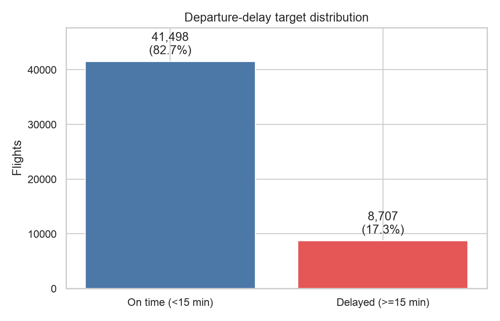
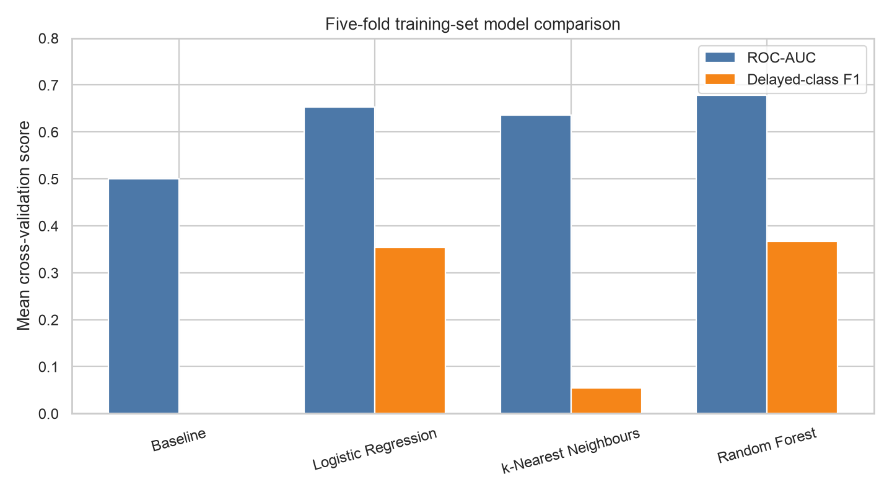
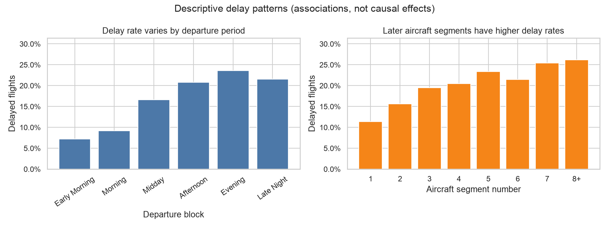

# Flight Delay Prediction

Leakage-safe binary classification of US domestic departure delays using **50,205 flight records** from January 2019. The project asks whether a flight can be identified as delayed by at least 15 minutes using information plausibly available before departure.



## Analytical question

Can schedule, aircraft rotation, carrier, and airport context distinguish flights likely to depart at least 15 minutes late?

The target is `DEP_DEL15`: `1` for a departure delay of 15 minutes or more and `0` otherwise. Only 17.3% of records are delayed, so accuracy alone is misleading: an always-on-time classifier is 82.7% accurate while detecting no delayed flights. Model comparison therefore prioritises ROC-AUC and also reports average precision, delayed-class precision, recall, and F1.

## Dataset

The included dataset contains 50,205 rows and 24 columns covering 17 carriers and 84 departure airports. Available fields describe schedules, aircraft rotations, capacity, carrier/airport activity, geography, and realized daily weather.

The data has no calendar date beyond day of week. It therefore supports a reproducible stratified holdout, but not the stronger month-forward or time-forward validation required for deployment.

## Leakage-safe methodology

1. Reserve a stratified 20% final test set (10,041 flights) with random seed 42.
2. Compare a prior-probability baseline, logistic regression, 21-neighbour k-NN, and random forest using five-fold stratified cross-validation on the remaining 40,164 rows.
3. Put imputation, scaling, rare-category handling, and one-hot encoding inside an sklearn `Pipeline` and `ColumnTransformer`, so every transformation is learned from the relevant training fold only.
4. Select the model with the best mean training cross-validation ROC-AUC, refit its complete pipeline on all training rows, and evaluate it once on the holdout.

Realized weather summaries (`PRCP`, `SNOW`, `SNWD`, `TMAX`, `AWND`) and current-month flight aggregates are excluded from modelling because their availability before the intended prediction time cannot be established. They remain in the raw data for transparent descriptive review.

The original coursework workflow separately target-encoded complete training and test files. Test labels therefore influenced test features, while validation-fold labels influenced cross-validation features. This repository was subsequently refactored; none of the historical scores are retained as valid results. See [methodology and limitations](docs/methodology-and-limitations.md).

## Results

Random forest achieved the strongest mean cross-validation ROC-AUC and was selected before the holdout was evaluated.

| Model | CV ROC-AUC | CV average precision | CV precision | CV recall | CV F1 |
| --- | ---: | ---: | ---: | ---: | ---: |
| Prior baseline | 0.500 | 0.173 | 0.000 | 0.000 | 0.000 |
| Logistic regression | 0.653 | 0.272 | 0.248 | 0.618 | 0.353 |
| k-nearest neighbours | 0.636 | 0.263 | 0.365 | 0.029 | 0.054 |
| **Random forest** | **0.678** | **0.304** | 0.289 | 0.503 | **0.367** |

Final random-forest results on the untouched test set:

| ROC-AUC | Average precision | Accuracy | Precision | Recall | F1 |
| ---: | ---: | ---: | ---: | ---: | ---: |
| **0.684** | **0.314** | 0.699 | 0.292 | 0.517 | 0.373 |

At the default 0.5 threshold, the model identified 900 of 1,741 delayed flights and produced 2,181 false alerts. Class-balanced training improves delayed-flight recall at the cost of lower accuracy and precision; the threshold should be chosen from an explicit operational cost model, not assumed to be optimal.



## Interpretable findings

Holdout permutation importance identifies departure time block as the strongest predictive feature, followed by previous airport and aircraft segment number. Descriptively, delay rates rise from 7.1% in early morning to 23.4% in evening flights, and generally increase across later aircraft segments. These are predictive associations, not evidence that changing a feature would cause delays to fall.



Additional evaluation figures: [confusion matrix](results/figures/confusion_matrix.png), [ROC curve](results/figures/roc_curve.png), and [feature importance](results/figures/feature_importance.png).

## Repository structure

```text
.
├── data/raw/                         # Included source dataset
├── docs/                             # Original report and methodology audit
├── results/                          # Recomputed metrics and figures
├── src/flight_delay/modeling.py      # Preprocessing, training, evaluation, plots
├── tests/test_modeling.py            # Data-contract and pipeline tests
├── requirements.txt
└── run_analysis.py                   # Reproduction entry point
```

## Reproduce

Python 3.11 or newer is recommended.

```bash
python3 -m venv .venv
source .venv/bin/activate
python -m pip install -r requirements.txt
python -m unittest discover -s tests -v
python run_analysis.py
```

The run recreates all CSV/JSON metrics and PNG figures in `results/`. It also creates an ignored `results/model_pipeline.joblib` containing preprocessing and the selected classifier together.

## Limitations and next steps

- One month of data cannot demonstrate seasonal or future-period generalisation.
- Missing flight dates prevent grouped or chronological evaluation and make duplicate-flight assessment uncertain.
- Daily weather observations are not valid forecast inputs; a future version should join timestamped weather forecasts.
- The dataset does not identify scheduled departure timestamps, destination airports, inbound delays, cancellations, or operational interventions.
- Hyperparameters and the 0.5 decision threshold are intentionally simple. Future tuning must remain inside training-only nested validation.
- Reported importance is model-specific and correlated features can share or mask permutation importance.

Original university team project by Songlin Yang, Qianting Yang, Shijia Rong, and Xinyi Ji (2021); methodology and implementation subsequently refactored for reproducibility.

